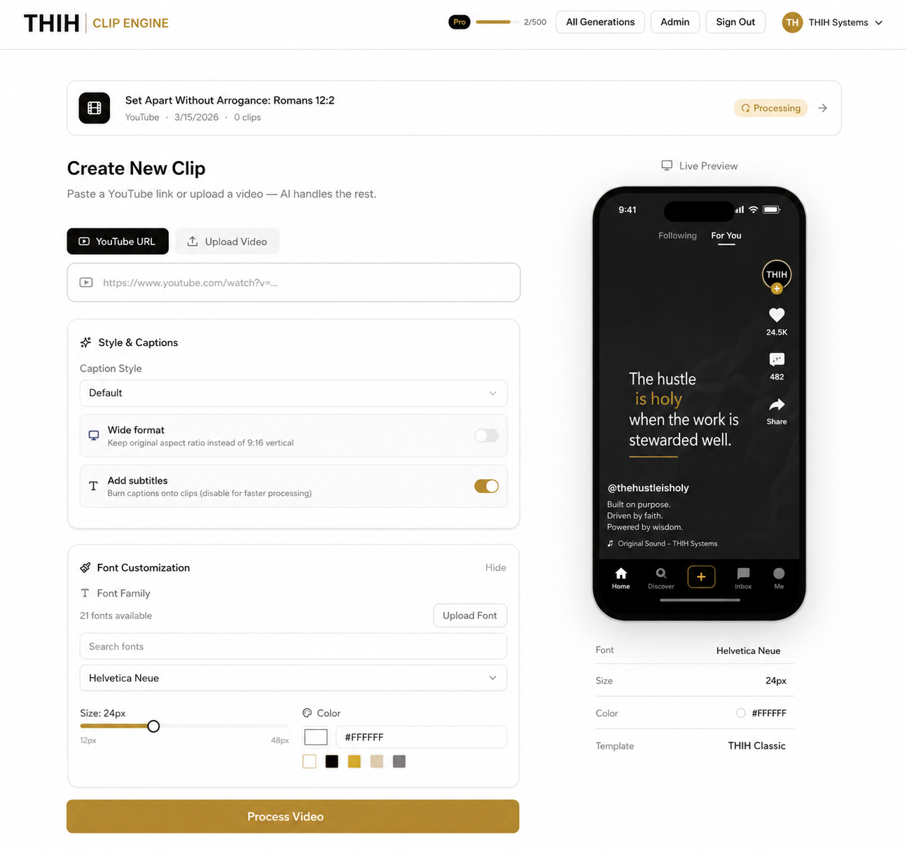

# THIH Clip Engine

**AI-powered video clipping for sermons, messages, podcasts, teachings, and purpose-driven media.**

Good clips should not come with ugly watermarks, platform lock-in, or creative hostage-taking.

THIH Clip Engine gives creators, ministries, teachers, operators, and service-minded builders a self-hostable clipping system they can run, inspect, customize, and steward on their own terms.

<p align="center">
  
</p>

## What THIH Clip Engine Does

THIH Clip Engine turns long-form video into short-form clips using transcription, AI-assisted segment selection, captions, editing tools, and export workflows.

It is designed for:

* Sermon shorts
* Podcast cutdowns
* Teaching clips
* Devotional moments
* Testimony highlights
* YouTube Shorts
* Instagram Reels
* TikTok clips
* LinkedIn thought leadership
* THIH Systems content
* Faith, work, leadership, and marketplace ministry media

This project is built for creators who believe content should serve before it sells.

## Why This Exists

Most clipping tools are useful, but they usually come with trade-offs:

* Processing limits
* Export restrictions
* Watermarks
* Locked workflows
* Limited customization
* Dependency on someone else’s platform
* Pricing that grows as your content volume grows

That may work for casual creators.

It does not work for builders, ministries, churches, educators, founders, or service businesses that need ownership, repeatability, and long-term control.

THIH Clip Engine exists to give you a clipping system you can shape around your own mission.

## The THIH Difference

THIH Clip Engine is not merely a “viral clip finder.”

It is being customized to support content that is:

* Clear
* Useful
* Purposeful
* Platform-ready
* Brand-aligned
* Stewarded well
* Rooted in message integrity

Virality matters, but it is not the altar.

Reach is useful. Stewardship is better.

## Core Features

* AI-assisted clip generation from long-form video
* YouTube URL and file upload support
* Automated transcription through AssemblyAI
* LLM-powered transcript analysis
* Short-form clip recommendations
* Caption generation and styling
* Clip preview and review workflow
* Export-ready short-form assets
* Self-hosted deployment through Docker Compose
* PostgreSQL metadata storage
* Redis-powered background processing
* FastAPI backend
* Next.js frontend
* Customizable codebase
* No forced platform watermark
* No vendor lock-in

## Intended THIH Use Cases

### THIH Ministry

Use the engine to create sermon clips, devotional shorts, teaching moments, and faith-based content that helps people hear, understand, and apply the Word.

Examples:

* “Set Apart Without Arrogance”
* “Fruit Is God’s Department, Abiding Is Yours”
* “The Armor of God Is Not Symbolic”
* “Renew Your Mind”
* “Stewardship Over Striving”

### THIH Systems

Use the engine to create LinkedIn and short-form business content from long-form strategy sessions, founder thoughts, AI systems breakdowns, client education, and operational teachings.

Examples:

* AI systems clips
* Follow-up pipeline breakdowns
* Lead capture education
* Workflow infrastructure insights
* Service-business operations content
* Founder-led market positioning

### THIH Studios

Use the engine as the production layer for podcasts, YouTube episodes, sermon clips, music reflections, and brand media.

Examples:

* Podcast clips
* YouTube Shorts
* Spotify video clips
* Instagram Reels
* Sermon quote videos
* Teaching highlights

## Quick Start

### Prerequisites

Before running THIH Clip Engine, make sure you have:

* Docker
* Docker Compose
* An AssemblyAI API key for transcription
* One supported LLM provider for AI analysis

Supported LLM provider options may include:

* Google Gemini
* OpenAI
* Anthropic Claude
* Ollama for local or self-hosted models

## 1. Clone the Repository

```bash
git clone https://github.com/thehustleisholy-ship-it/THIH-Clip-Engine.git
cd THIH-Clip-Engine
```

## 2. Create Your Environment File

Create a `.env` file in the project root.

```env
# Required: Video transcription
ASSEMBLY_AI_API_KEY=your_assemblyai_api_key

# Required: Choose ONE LLM provider and set its API key

# Option A: Google Gemini
LLM=google-gla:gemini-3-flash-preview
GOOGLE_API_KEY=your_google_api_key

# Option B: OpenAI
# LLM=openai:gpt-5.2
# OPENAI_API_KEY=your_openai_api_key

# Option C: Anthropic Claude
# LLM=anthropic:claude-4-sonnet
# ANTHROPIC_API_KEY=your_anthropic_api_key

# Option D: Ollama, local or self-hosted
# LLM=ollama:gpt-oss:20b
# OLLAMA_BASE_URL=
# OLLAMA_API_KEY=

# Optional: Auth secret, change this in production
BETTER_AUTH_SECRET=change_this_in_production

# Optional: Analytics
# NEXT_PUBLIC_DATAFAST_WEBSITE_ID=dfid_xxxxx
# NEXT_PUBLIC_DATAFAST_DOMAIN=your-domain.com
# NEXT_PUBLIC_DATAFAST_ALLOW_LOCALHOST=false

# Optional: Resend email support
# RESEND_API_KEY=your_resend_api_key
# RESEND_FROM_EMAIL=your_verified_sender_email

# Optional: YouTube metadata provider
# YOUTUBE_METADATA_PROVIDER=yt_dlp
# YOUTUBE_DATA_API_KEY=your_youtube_data_api_key

# Optional: Processing mode
# DEFAULT_PROCESSING_MODE=fast
# FAST_MODE_MAX_CLIPS=4
# FAST_MODE_TRANSCRIPT_MODEL=nano
```

## 3. Start the Services

```bash
docker-compose up -d
```

This starts:

* Frontend: `http://localhost:3000`
* Backend API: `http://localhost:8000`
* API docs: `http://localhost:8000/docs`
* PostgreSQL: `localhost:5432`
* Redis: `localhost:6379`

## 4. Watch the Startup Logs

First-time startup may take a few minutes.

```bash
docker-compose logs -f
```

Wait until the frontend, backend, worker, PostgreSQL, and Redis services are healthy.

## 5. Open the App

Go to:

```text
http://localhost:3000
```

Create an account, upload a video or paste a YouTube URL, then begin generating clips.

## Local Development

For local development without Docker, review the project documentation and setup files before changing services directly.

Common development flow:

```bash
docker-compose up -d
docker-compose logs -f backend
docker-compose logs -f worker
docker-compose logs -f frontend
```

If you make environment changes, rebuild the stack:

```bash
docker-compose up -d --build
```

## Troubleshooting

### Backend fails to start with an API key error

Check that your selected `LLM` provider matches the API key you provided.

Examples:

* `google-gla:*` requires `GOOGLE_API_KEY`
* `openai:*` requires `OPENAI_API_KEY`
* `anthropic:*` requires `ANTHROPIC_API_KEY`
* `ollama:*` requires Ollama to be running and reachable

After changing `.env`, rebuild the containers:

```bash
docker-compose up -d --build
```

### Videos stay queued and never process

Check the worker logs:

```bash
docker-compose logs -f worker
```

Then verify Redis is healthy:

```bash
docker-compose logs redis
```

Also confirm that your transcription and LLM API keys are valid.

### YouTube title or duration lookup fails

The app can use different metadata providers.

```env
YOUTUBE_METADATA_PROVIDER=yt_dlp
```

or:

```env
YOUTUBE_METADATA_PROVIDER=youtube_data_api
YOUTUBE_DATA_API_KEY=your_youtube_data_api_key
```

If YouTube Data API is used, make sure YouTube Data API v3 is enabled in Google Cloud.

### Frontend shows database errors

PostgreSQL may still be initializing.

Check the logs:

```bash
docker-compose logs postgres
```

If needed, reset local volumes:

```bash
docker-compose down -v
docker-compose up -d --build
```

### Font picker is empty

Add fonts to:

```text
backend/fonts/
```

Review:

```text
backend/fonts/README.md
```

### Exports or captions fail

Check:

* Worker logs
* Backend logs
* File storage permissions
* API key validity
* Available disk space
* Processing mode settings

## Processing Modes

THIH Clip Engine can be tuned for speed or quality.

```env
DEFAULT_PROCESSING_MODE=fast
FAST_MODE_MAX_CLIPS=4
FAST_MODE_TRANSCRIPT_MODEL=nano
```

Suggested modes:

* `fast`, best for quick sermon and podcast review
* `balanced`, best for routine publishing workflow
* `quality`, best for final production assets

## Recommended THIH Workflow

Use this process when turning long-form content into clips:

1. Upload the sermon, podcast, teaching, or strategy video.
2. Let THIH Clip Engine transcribe and analyze the content.
3. Review the recommended clips.
4. Select clips based on clarity, usefulness, conviction, and platform fit.
5. Edit captions and framing.
6. Export platform-ready clips.
7. Create post copy, captions, titles, and calls to action.
8. Publish intentionally.
9. Track what serves people, not only what performs.

## Planned THIH Customizations

This fork is being prepared for deeper THIH-specific workflows, including:

* THIH brand canon reset
* Sermon-specific clip scoring
* Devotional clip mode
* THIH Systems business content mode
* Scripture reference suggestions
* Caption and post copy generation
* LinkedIn post generation
* YouTube Shorts description generation
* Instagram caption generation
* Platform-specific export notes
* Content packet generation per clip
* Canon fit scoring
* Stewardship scoring
* Message integrity checks

## Testing

This fork may inherit automated test commands from the upstream project. Verify the current test suite before treating coverage as complete.

Potential repo-level commands:

```bash
make test
make test-backend
make test-frontend
make test-e2e
make test-ci
```

Potential app-level commands:

```bash
cd backend && uv sync --all-groups && .venv/bin/pytest
cd frontend && npm install && npm run test:coverage
cd frontend && npm run test:e2e
```

Local test runs may require PostgreSQL and Redis.

Recommended path:

```bash
docker-compose up -d
make test
```

If tests are not fully implemented or fail because of inherited upstream drift, document the actual status clearly before production use.

## Production Readiness Checklist

Before connecting this to the broader THIH Ecosystem, verify:

* The app builds cleanly
* Docker Compose starts all services
* Frontend loads successfully
* User authentication works
* Upload task creation works
* YouTube task creation works
* Redis queue processes jobs
* Worker generates clips
* Clip preview works
* Captions render correctly
* Exports complete successfully
* Logs are understandable
* Secrets are not committed
* Public copy says THIH Clip Engine
* Upstream SupoClip language remains only where attribution or license context requires it
* Documentation matches the actual app behavior

## Documentation

Detailed documentation lives in:

```text
docs/
```

Suggested starting points:

* `docs/setup.md`
* `docs/configuration.md`
* `docs/app-guide.md`
* `docs/architecture.md`
* `docs/api-reference.md`
* `docs/development.md`
* `docs/troubleshooting.md`

## Security Notes

Do not commit real secrets.

Keep these values private:

* AssemblyAI API keys
* Google API keys
* OpenAI API keys
* Anthropic API keys
* Resend API keys
* Stripe secrets
* Auth secrets
* Database credentials
* Production domain configuration

Use `.env` for local development and your hosting provider’s secret manager for production.

## Upstream Attribution

THIH Clip Engine is a customized fork based on SupoClip by FujiwaraChoki.

The original project is released under the AGPL-3.0 License. This fork preserves the license obligations and upstream attribution while adapting the product for THIH use cases.

## License

This project is released under the AGPL-3.0 License.

See:

```text
LICENSE
```

## Final Word

THIH Clip Engine is built on a simple conviction:

Your message should not be trapped inside long-form content.

When a sermon, teaching, podcast, or business insight carries value, it should be clipped, clarified, and released with excellence.

Not for vanity.

Not for noise.

For service.
